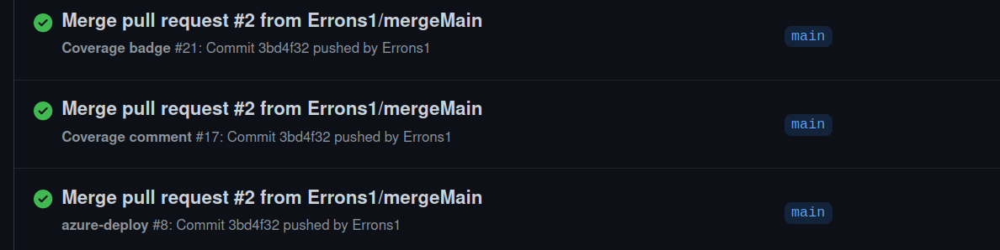

### [Link to azure deployment](https://pg6301-exam.azurewebsites.net/)

# pg6301-exam
Checklist of technologies you should include in your application
* [x] Some form of Login and access control
* [ ] Jest tests
* [ ] Snapshot tests
* [ ] Simulate + jest.fn
* [ ] Supertest
* [x] GitHub Actions with coverage report
* [x] Deployment to cloud (in this case, Azure)
* [x] Mongodb
* [x] Navigating in the application using React Router (remember Express Middleware)
* [x] Reading data from the server (remember error handling)
* [x] Writing data to the server
* [ ] Websockets

# Notes from exam
* I have used my own personal GitHub to get access to GitHub Actions for badge and azure deploy.
  NOTE both work, but since they lack secrets in the classroom repo the test will fail.
  Here is a screenshot from my private repo as proof they work on my private one. 
  
* I did write a some test but got into some heavy bugs with Jest getting forced exit by supertest. 
  This made me put empty testes and my coverage is noted as 0%. I believe the same errors made my test show 0%
  coverage when I had them and ran them one and one. 
  Here is a link for more information about the testing bug I experienced:
  https://github.com/testing-library/dom-testing-library/issues/524.